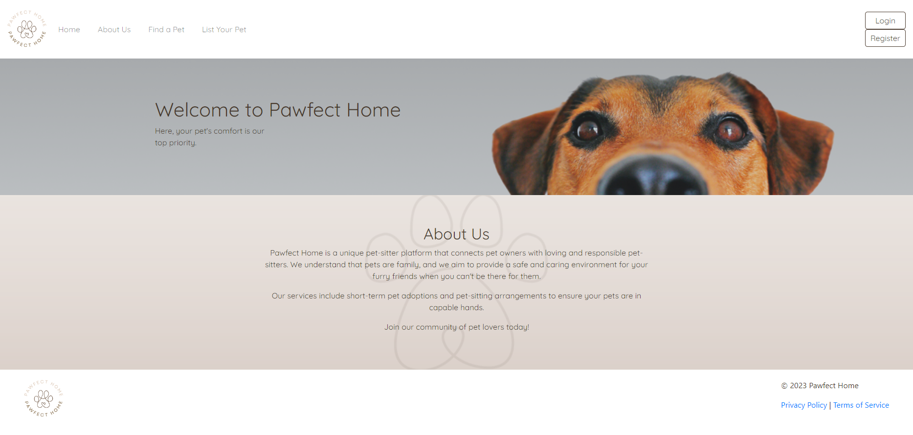
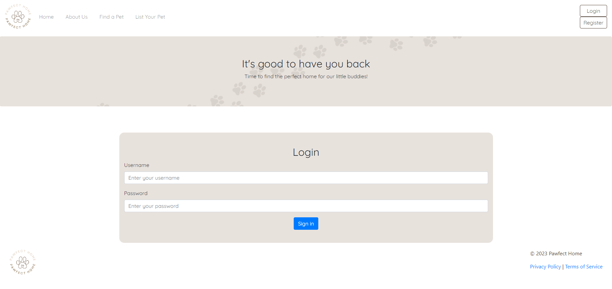
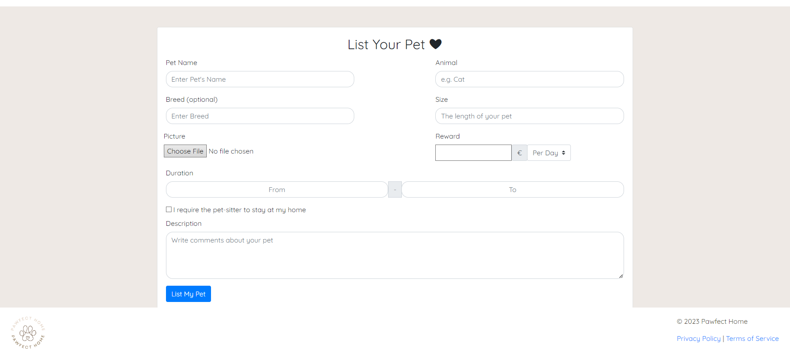
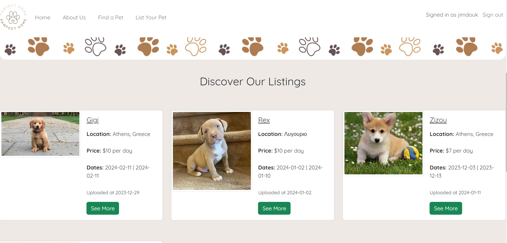

# PawFect-Home

**PawFect Home** is a platform  that is all about helping animals find a new home or a new human-friend for a short time. It is developed for the purpose of our programming courses in the Athens University of Economics and Business, Department of Managment and Science Technology. As it is a student project, we made it open source. 

**Goal**
Pawfect Home is a unique pet-sitter platform that connects pet owners with loving and responsible pet-sitters. We understand that pets are family, and we aim to provide a safe and caring environment for your furry friends when you can't be there for them.
Our services include short-term pet adoptions and pet-sitting arrangements to ensure your pets are in capable hands.

✅ **Features**: 
 1. Post listings about pets that need to find a pet-sitter
 2. Find listings about pets  available for pet-sitting

 ## Screenshots & User Stories

### 1.Homepage
 

<i>That's the landing page</i>

### 2.Login

<i>You can login to obtain post and "i'm interested" permissions</i>

### 3.Post about your pet

<i>Create a post to attract pet-sitters!</i>

### 4. Find a pet to take care of

<i>Find a pet that you want to have fun with</i>

